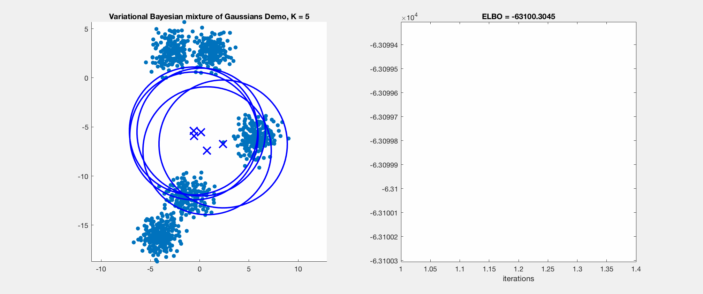

# Gaussian Mixture Model and Inference Algorithm in Matlab
A Matlab demo about Gaussian Mixture Model (GMM) and inference algorithm with EM and Variational Inference

## Reference
Christopher M. Bishop. 2006. Pattern Recognition and Machine Learning (Information Science and Statistics). Springer-Verlag, Berlin, Heidelberg. 

## Requirements
This code is tested by Matlab R2017a.

## Usage example
### Run the GMM demo with EM algorithm

```
gmm_em_demo
```
<p align="center"></p>

### Run the GMM demo with Variational Inference algorithm

```
gmm_vb_demo
```
<p align="center"></p>